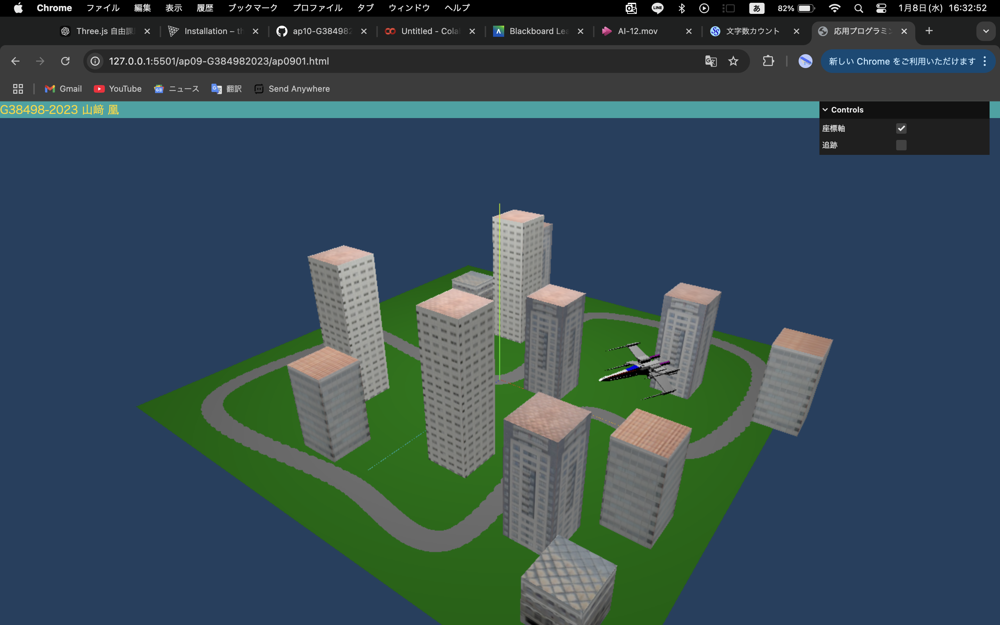

# X-Wingと巡る仮想都市シミュレーション

応用プログラミングレポート @G384982023 山﨑 凰

## 作品の概要
本作品は、Three.js を用いて作成した都市シミュレーションアプリケーションです。
シーンには道路、建物、草地が表示され、プレイヤーが操作する X-Wing モデルが都市内を自由に移動します。
さらに、カメラの追尾機能や座標軸の表示切り替えなど、インタラクティブな要素を盛り込んでいます。



## シーンの特徴
* 表示内容:シーンには以下の要素が表示されます。
    * 道路: 制御点から生成された滑らかな曲線上に設置された舗装路。
    * 建物: 高さやテクスチャが異なる複数の建物をランダムに配置。
    * プレイヤー機体 (X-Wing): GLTFLoader を用いて読み込んだモデル。

* ユーザ操作:ユーザはキーボード操作で X-Wing を移動できます。以下は主な操作方法です。
    * 矢印キー: 機体の移動・回転
    * スペースキー: 上昇
    * シフトキー: 下降

## 代表的な変数の説明

* controlPoints:道路を構成する制御点の配列。以下のように Catmull-Rom 曲線を生成する際の基盤となっています。
```javascript
      const course = new THREE.CatmullRomCurve3(
  controlPoints.map((p) => new THREE.Vector3(offset.x + p[0], 0, offset.z + p[1]))
);

```

* xwing:ユーザが操作する X-Wing モデルを格納する変数です。以下のコードでモデルを読み込み、初期位置やスケールを設定しています。
```javascript
loader.load("xwing.glb", (gltf) => {
  xwing = gltf.scene;
  xwing.scale.set(2, 2, 2);
  xwing.position.set(0, 10, 0);
  scene.add(xwing);
});
```

* keys:キーボード入力を管理するフラグオブジェクト。各キーの押下状態を記録し、X-Wing の動作に反映しています。


## 工夫(苦心)したところ

* カメラ追尾機能の実装:
プレイヤーが操作する X-Wing をカメラが追尾する際、カメラの移動をスムーズにするために以下のコードを使用しました。
```javascript
const targetPosition = new THREE.Vector3().copy(xwing.position).add(
  cameraOffset.clone().applyAxisAngle(new THREE.Vector3(0, 1, 0), xwing.rotation.y)
);
camera.position.lerp(targetPosition, 0.1);
```
この処理により、カメラが突然動かず、自然な追尾動作を実現しています。

* ビルのテクスチャマッピング:
建物にテクスチャを適用し、高さや種類ごとに異なる外観を持たせました。

## 参考にした資料

* Three.js Documentation
URL: https://threejs.org/docs/
Three.js の基本的な機能や構文を学ぶために参照しました。

* 「ap0701.js」のxwingを参考にしました。

* 「ap08L3.js」の道と建造物を参考にしました。

## 感想

自由課題を通じて、Three.js を用いた 3D シミュレーションの可能性を深く理解することができました。このプロジェクトでは、視覚的な表現だけでなく、ユーザーが操作しやすいインタラクティブなシステムを構築することに注力しました。特に、モデルの動作やカメラの挙動を自然に見せる工夫が非常に重要であると実感しました。カメラがモデルの動きにスムーズに追従することで、没入感のある操作体験を提供できたことが成果の一つだと感じています。また、ビジュアル面だけでなく、コードの簡潔さや可読性を保つことの難しさも改めて感じる機会となりました。関数化やコメントの活用を心がけたものの、さらなる改善点があることにも気づくことができました。
